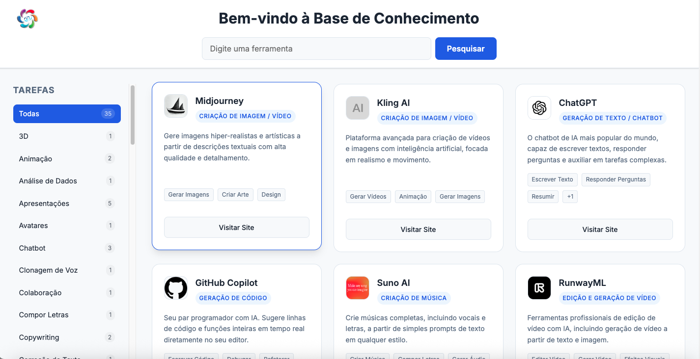

# 🧠 AlquimiaZen - Base de Conhecimento de IA

> Uma curadoria interativa de ferramentas de Inteligência Artificial, projetada para ajudar você a encontrar a solução perfeita para suas tarefas criativas e produtivas.



## ✨ Sobre o Projeto

Este projeto é uma **Base de Conhecimento** inspirada no design funcional de "There's An AI For That". Ele reúne as melhores ferramentas de IA do mercado em uma interface limpa, rápida e fácil de navegar.

O objetivo é simplificar a descoberta de ferramentas, permitindo que o usuário filtre não apenas pelo nome, mas pela **tarefa** que deseja realizar (ex: "Gerar Imagens", "Criar Música", "Programar").

## 🚀 Funcionalidades

-   **🔍 Busca Inteligente**: Pesquise ferramentas por nome, tipo ou descrição em tempo real.
-   **📂 Filtro por Tarefas**: Navegue por categorias específicas através da barra lateral dinâmica.
-   **🏷️ Tags Visuais**: Visualize rapidamente as capacidades de cada ferramenta nos cards.
-   **🎨 Design Responsivo**: Interface moderna e adaptável para desktop e mobile.
-   **⚡ Performance**: Construído com Vanilla JS, leve e extremamente rápido.

## 🛠️ Tecnologias Utilizadas

-   **HTML5**: Estrutura semântica e acessível.
-   **CSS3**: Layouts modernos com **Grid** e **Flexbox**, variáveis CSS para temas e design responsivo.
-   **JavaScript (ES6+)**: Lógica de filtragem, manipulação do DOM e consumo de dados JSON.
-   **JSON**: Base de dados estruturada das ferramentas.

## 📦 Como Rodar Localmente

Para evitar problemas de política de mesma origem (CORS) ao carregar o arquivo `data.json`, é necessário rodar a aplicação em um servidor local.

### Pré-requisitos

-   Navegador Web moderno.
-   **Python** (instalado na maioria dos sistemas) ou extensão **Live Server** no VS Code.

### Passo a Passo

1.  **Clone o repositório** (ou baixe os arquivos):
    ```bash
    git clone https://github.com/seu-usuario/alquimiazen-base-conhecimento.git
    ```

2.  **Acesse a pasta do projeto**:
    ```bash
    cd base-conhecimento
    ```

3.  **Inicie o servidor**:
    
    Com Python 3:
    ```bash
    python3 -m http.server 8080
    ```
    
    *Ou simplesmente abra o arquivo `index.html` com o "Live Server" do VS Code.*

4.  **Acesse no navegador**:
    Abra `http://localhost:8080`

## 📂 Estrutura do Projeto

```
base-conhecimento/
├── index.html      # Estrutura principal da página
├── style.css       # Estilos, layout e responsividade
├── script.js       # Lógica de busca, filtros e renderização
├── data.json       # Banco de dados das ferramentas de IA
├── logo.png        # Logotipo da aplicação
├── preview.png     # Imagem de demonstração
└── README.md       # Documentação do projeto
```

## 🤝 Contribuição

Contribuições são bem-vindas! Se você conhece uma ferramenta de IA incrível que não está na lista:

1.  Faça um Fork do projeto.
2.  Adicione a ferramenta no arquivo `data.json`.
3.  Abra um Pull Request.

---

Desenvolvido com 💜 por **AlquimiaZen**
